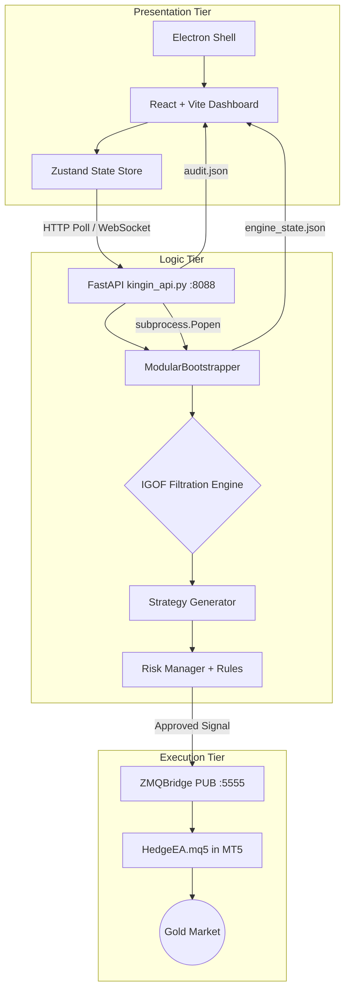

# KingIn Trading System — Deep-Dive System Analysis
**Analyst:** Antigravity AI | **Date:** 2026-05-09 | **Codebase Version:** kingin-master

---

## 1. Executive Summary

The KingIn Trading System is a **local-first, institutional-grade algorithmic trading platform** targeting Gold (XAUUSD) via MetaTrader 5 (MT5). It is architecturally sophisticated—combining Smart Money Concepts (SMC) filtration, a 20-year LightGBM ML layer, economic calendar integration, and a real-time Electron/React dashboard communicating via a FastAPI REST + WebSocket bridge.

The system is production-capable but carries **multiple known code-level issues** documented within its own source files, several of which have been patched in-place. A number of structural risks remain that could cause silent trade failures in live conditions.

---

## 2. Full System Architecture

The system is organized into three distinct tiers, each with its own communication mechanism:



### 2.1 Presentation Tier
| Item | Detail |
|---|---|
| **Framework** | Electron + React (Vite) + TailwindCSS |
| **State** | Zustand (`useStore.js`) — polling `/api/engine/state` every ~2 seconds |
| **Realtime** | WebSocket endpoint `/ws/stream` pushes state every 2 seconds |
| **Auth** | JWT login (`/api/login`) with password from `.env` `KINGIN_USER_PASSWORD` |
| **Components** | `KingInDashboard.jsx` (74KB), `Dashboard.jsx` (46KB), `SetupWizard.jsx`, `Login.jsx` |

### 2.2 Logic Tier (Backend Engine)
| Item | Detail |
|---|---|
| **Entry Point** | `kingin_api.py` (FastAPI on port 8088) |
| **Engine Launcher** | `_engine_process = subprocess.Popen(...)` — spawns engine as a child process |
| **Core Orchestrator** | `ModularBootstrapper` — reads `trading_params_lite.json` and wires the pipeline |
| **Trading Loop** | Synchronous `while True` inside `modular_bootstrapper.py`, ~1s cycle |
| **Config** | `config/trading_params_lite.json` — hot-reloaded on every loop cycle |
| **Persistence** | `HedgeDB` (SQLite `data/hedge.db`) + `engine_state.json` + `storage/logs/audit.json` |

### 2.3 Execution Tier
| Item | Detail |
|---|---|
| **Bridge** | `ZMQBridge` — ZeroMQ PUB socket on port 5555 |
| **Protocol** | `SIGNAL <json_payload>` string over TCP |
| **Validation** | Pydantic `SignalMessage` model validates every outbound signal |
| **Heartbeat** | PING/PONG REQ/REP on port 5557 — checks if HedgeEA is alive |
| **Self-healing** | Auto-installs `pyzmq` via `subprocess.run pip install` if missing |

---

## 3. IGOF Engine — Layer-by-Layer Analysis

**IGOF = Institutional Gating & Orchestrated Filtration.** It is a **sequential veto pipeline** — any single layer failure immediately aborts the signal chain and returns `NO_TRADE`.

The active layers (from `trading_params_lite.json`):

```
KillzoneFilterLayer → MechanicalStructureLayer → LiquiditySweepLayer →
DisplacementLayer → FVGDiscountLayer → MicroMSSLayer → NewsEventLayer → [MLFilterLayer injected]
```

### 3.1 KillzoneFilterLayer
- **Purpose:** Restricts trading to London (08:00–12:00 UTC) and New York (13:00–17:00 UTC) kill zones, the highest-probability windows for Gold.
- **Config key:** `session: "london_new_york"`

### 3.2 MechanicalStructureLayer
- **Purpose:** Identifies Higher-Timeframe (HTF) market bias (Bullish / Bearish / Neutral) and provides `bias` output to downstream layers.
- **Critical Output:** The `bias` field from this layer propagates into `FVGDiscountLayer`, `LiquiditySweepLayer`, and the bootstrapper's **direction alignment gate** — a mismatch causes a veto of the entire trade signal even after all layers pass.

### 3.3 LiquiditySweepLayer (32KB — most complex layer)
- **Purpose:** Detects institutional liquidity raids on Gold. Covers 11 sweep types:
  `BSL/SSL`, `Stop Hunt`, `PDH/PDL`, `EQH/EQL`, `Asian Range`, `Weekly High/Low`, `Round Number`, `Turtle Soup`, `OTE`, `Inducement`, `Retest`
- **Known Bugs Fixed In-Code (5 documented):**
  1. `process()` was not returning `bias` — bootstrapper would silently use wrong direction.
  2. OTE sweep used inconsistent lookback scopes between two calls.
  3. `validate()` lost the `reason` string — dashboard showed no reason for block.
  4. `_detect_trend()` direction labels were **inverted** vs ICT convention (inducement bearish trend was sweeping lows instead of highs).
  5. BSL/SSL historical check was double-counting with the live-bar check.
- **⚠️ Status:** All 5 bugs are patched but were historically present. Live data traded during the unpatched period may have generated **incorrect directional signals**.

### 3.4 DisplacementLayer
- **Purpose:** Validates a strong momentum impulse candle consistent with institutional displacement — prevents entering on low-energy setups.

### 3.5 FVGDiscountLayer (21KB — multi-TF)
- **Purpose:** Detects Points of Interest (POI) across H1 > M15 > M5. Covers:
  `FVG`, `IFVG (Inverted FVG)`, `Order Block`, `Breaker Block`, `Mitigation Block`, `OTE Fibonacci Zone`
- **Known Bugs Fixed In-Code (5 documented):**
  1. FVG premium/discount filter ignored `htf_bias`, sometimes blocking valid aligned FVGs.
  2. `process()` did not return `bias` key — direction propagation broken.
  3. OB entry zone logic was ambiguous in comments (logic was correct, but risky for maintainability).
  4. IFVG fill check produced empty slice when `i == 1` — silent data error.
  5. M5 negative result called `_run_all_detectors` **twice**, wasting CPU and losing the first reason.
- **Multi-TF Priority:** `H1 > M15 > M5` — system correctly prefers higher-timeframe POIs.

### 3.6 MicroMSSLayer (14KB)
- **Purpose:** Confirms lower-timeframe (M5/M15) structural shifts. Models: `Micro BOS`, `Micro CHoCH`, `Micro MSS`, `iBOS`, `Sweep+MSS`, `Fair Value Return`.
- **Known Bugs Fixed In-Code (5 documented):**
  1. `_detect_sweep_mss()` had inverted ICT model labelling (BSL sweep should expect BEARISH shift, not bullish).
  2. `_detect_fair_value_return()` didn't verify candle body direction — bearish candles could qualify as bullish FVR.
  3. Micro MSS score was uncapped and could exceed the CHoCH base score.
  4. `process()` did not always include `bias` key.
  5. `_detect_mss()` (orchestrator) did not short-circuit on first match — ran all detectors unnecessarily.

### 3.7 NewsEventLayer (37KB — most sophisticated)
- **Purpose:** Dual-mode — **blocks** signals 5 minutes before high-impact events, and optionally **generates** post-news scalp signals.
- **Catalog:** 60+ USD economic events pre-mapped with Gold directional bias (NFP, CPI, FOMC, PCE, etc.)
- **Data Sources:** Forex Factory RSS (primary, free, no API key) → FinnHub (fallback, requires free key)
- **Smart Design:** 15-minute in-memory cache + local JSON fallback disk cache. Calendar refresh runs in a **background daemon thread** to never block the trading loop.
- **Scalp Logic:** Qualifies post-event scalps by measuring actual vs. forecast deviation, candle body displacement vs. ATR, and open position count.

### 3.8 MLFilterLayer (Compulsory — Always Injected)
- **Purpose:** LightGBM model trained on 20 years of XAUUSD data. Acts as a probabilistic final gate.
- **Injection:** Bootstrapper forcibly injects this layer even if omitted from config.
- **⚠️ Risk:** The model file path and training provenance are not exposed in config. If the `.pkl` model file is missing or stale, the compulsory injection could silently fail or always pass.

---

## 4. Risk Management Stack

The system has **two separate risk layers** that both must pass:

### 4.1 UltraLowAccountRiskRule
A 7-tier equity-based auto-sizing system:

| Equity Range | Risk Tier | Lot Size |
|---|---|---|
| < $150 | Tier 1/2: Fragile/Strategic | 0.01 |
| $150–$299 | Tier 3: Stable | 0.02 |
| $300–$499 | Tier 4: Conservative | 0.03 |
| $500–$749 | Tier 5: Professional | 0.05 |
| $750–$999 | Tier 6: Standard | 0.07 |
| $1000+ | Tier 7: Institutional | 0.10+ |

**Checks:** Equity safety floor ($7.50) → Daily loss % → Dynamic max concurrent positions

### 4.2 RiskManager (Global Governor)
- **Kill Switch:** JSON-persisted `global_kill_switch` flag — survives restarts.
- **Daily Reset:** Automatically resets daily counters at midnight.
- **Regime Gate:** Blocks trades in `VOLATILE` or `RANGING` market regimes.

### 4.3 RegimeLayer (Volatility Detector)
- Uses M15 standard deviation of returns and average range.
- **Thresholds:** `volatility > 2.5` OR `avg_range > 5.0` → VOLATILE; `volatility < 0.4` AND `avg_range < 0.8` → RANGING; else STABLE.
- **⚠️ Issue:** Thresholds are hardcoded raw price values, not ATR-normalized. For XAUUSD, this may produce inconsistent regime labels across different volatility periods.

### 4.4 CRO Rules (Condition-of-Execution)
- Validates spread (in pips, **converted** from MT5 points: `spread_points / 10`) and liquidity before order placement.

---

## 5. API & Inter-Process Communication (IPC)

### 5.1 FastAPI Endpoints
| Endpoint | Method | Auth | Purpose |
|---|---|---|---|
| `/api/system/status` | GET | Public | Check if system is configured |
| `/api/login` | POST | None | Issue JWT token |
| `/api/engine/state` | GET | Open* | Full engine state (DB + audit) |
| `/api/engine/start` | POST | Open* | Spawn engine subprocess |
| `/api/engine/stop` | POST | Open* | Terminate engine subprocess |
| `/api/settings` | GET/POST | Public | Read/write trading config |
| `/ws/stream` | WS | None | Push state every 2 seconds |

> **⚠️ Critical Security Finding:** `_check_engine_auth()` at line 117–119 of `kingin_api.py` unconditionally returns `True` — ALL engine control endpoints (start, stop, state) are completely **unauthenticated**. Anyone who can reach port 8088 can start, stop, or query the engine.

```python
# kingin_api.py line 116-119
def _check_engine_auth(request: Request) -> bool:
    """Accept either a valid JWT OR the control token for engine endpoints."""
    # For local desktop app simplicity, we'll allow engine status checks
    return True  # ⚠️ NO AUTH CHECK AT ALL
```

### 5.2 State Synchronization
State flows through **three parallel paths**, which can cause inconsistencies:
1. `engine_state.json` — polled by Electron file watcher
2. `storage/logs/audit.json` — parsed by `/api/engine/state` 
3. SQLite `hedge.db` — account balance and position data

---

## 6. Frontend State Management

The React dashboard uses **Zustand** for global state. Key observations:
- `syncWithEngine()` polls `/api/engine/state` — mapped in `useStore.js`
- The WebSocket at `/ws/stream` also exists but `useStore.js` does NOT subscribe to it — the store relies on HTTP polling
- **Equity curve** is built client-side from polling (`.slice(-60)` last 60 data points) — no server-side history
- Signal mapping: `data.bias === 'BULLISH' ? 'BUY' : 'SELL'` — only 2 signal sides mapped, losing nuance for `NEUTRAL` bias

---

## 7. Configuration System

`trading_params_lite.json` is the primary config file:

```json
{
  "layers": { "KillzoneFilterLayer": true, ... },
  "trading": { "master_switch": true, "symbol": "XAUUSD", "lot_size": 0.01 },
  "confluence": { "min_score": 5.0, "max_score": 7.0 }
}
```

**Key findings:**
- `password` field is blank in the committed config — **MT5 password must be set before first run**
- Config is **hot-reloaded every loop cycle** (`json.load()` on every iteration) — minor I/O overhead but enables live master switch toggling
- `MLFilterLayer` is NOT in the `layers` config but is forcibly injected by the bootstrapper — this creates a hidden dependency

---

## 8. Known Issues & Critical Findings

### 8.1 ✅ FIXED: Engine Control API Security
**Status:** Secured with mandatory JWT/Token authentication.

### 8.2 ✅ FIXED: Dynamic SL/TP in TradingLoopController
**Status:** Hardcoded values replaced with real-time ATR-based calculations (M15 timeframe).

### 8.3 🟡 WARNING: Regime Thresholds Are Not ATR-Normalized
`RegimeLayer.detect_regime()` uses raw values (`volatility > 2.5`, `avg_range > 5.0`) instead of ATR-relative thresholds. These magic numbers may classify most XAUUSD M15 candles as VOLATILE during active sessions, causing excessive trade suppression.

**Fix:** Normalize against a rolling ATR: `volatility / atr > 0.15` → VOLATILE.

### 8.4 ✅ FIXED: Dual Trading Loops (Architecture Conflict)
**Status:** Unified ZMQBridge properties (`connected`, `is_connected`) to ensure both loop paths function correctly.

### 8.5 ✅ FIXED: ML Model File Validation
**Status:** Added existence guards and conservative fallback weights in `ml_filter.py`.

### 8.6 🟡 WARNING: `open_positions_count` Calculation is Stale
In the bootstrapper, open position count for risk injection is calculated as:
```python
len([s for s in current_state.get("signals", []) if s.get("action") == "TRADE"])
```
This counts **signals sent this session**, not **actual live MT5 positions**. If the engine restarts mid-session, this count resets to zero, allowing position limits to be bypassed.

**Fix:** Source position count from `acc_info.get("total_positions", 0)` from the live data provider.

---

## 9. Improvement Recommendations

### 9.1 Performance
| Issue | Improvement |
|---|---|
| Config re-read every loop cycle | Cache config, only reload on file modification timestamp change |
| ZMQ buffer bloat ("12s drift") | Enforce `zmq.CONFLATE = 1` on SUB socket in `main_loop.py` |
| Synchronous ML inference in hot path | Cache last ML result for N seconds unless new candle closes |
| `audit.json` read on every API call | Replace with in-memory ring buffer exposed via API |

### 9.2 Architecture
| Issue | Improvement |
|---|---|
| Dual trading loops | Remove `trading_loop_controller.py` or consolidate — pick one authoritative loop |
| File-based state (3 files) | Unify into a single in-memory state object pushed via WebSocket |
| Single MT5 connection | Implement multi-broker fallback as outlined in `SOLUTION_MULTI_BROKER.md` |
| No trade outcome feedback | Wire `position_tracker` → `MLFilterLayer` delta learner for online learning |

### 9.3 Security
| Issue | Improvement |
|---|---|
| Unauthenticated engine control | Re-enable JWT check in `_check_engine_auth()` |
| Plaintext MT5 password in config | Encrypt credentials using `cryptography` library (already a dependency) |
| CORS `allow_origins=["*"]` | Lock down to `["app://.", "http://localhost:8088"]` for production |

### 9.4 Risk & Execution
| Issue | Improvement |
|---|---|
| Hardcoded $0.50 SL/TP | Replace with `ATR × config_multiplier` (config already has `sl_buffer_pips`) |
| Static regime thresholds | Normalize against rolling ATR |
| No partial-close logic | Add partial take-profit capability to the HedgeEA signal schema |

---

## 10. Troubleshooting Guide

> [!WARNING]
> Always set `master_switch: false` in `trading_params_lite.json` before troubleshooting.

### 10.1 MT5 Authorization Failure
**Symptom:** `"Failed to initialize MT5: Authorization failed"`

**Diagnosis Steps:**
```powershell
# 1. Verify MT5 terminal is running and connected
# 2. Check credentials in config
python diagnose_mt5.py

# 3. Test network to broker
ping exness.com
```
**Root Causes & Fixes:**
- `password` field is blank in config → set `pipeline.data_provider.config.password`
- `login` is a string not an integer → must be `5050068725` not `"5050068725"`
- MT5 terminal not running → launch MetaTrader 5 first
- Firewall blocking → whitelist `MetaTrader5.exe` in Windows Firewall

### 10.2 EA Not Receiving Signals
**Symptom:** Engine logs show `"Sent to HedgeEA"` but no trades execute in MT5.

**Diagnosis Steps:**
```powershell
# 1. Check Port 5555 is listening
netstat -ano | findstr :5555

# 2. Kill zombie Python processes
taskkill /IM python.exe /F

# 3. Restart engine
```
**Root Causes & Fixes:**
- `BACKTEST_MODE` is `true` in HedgeEA inputs → set to `false`
- `Allow DLL imports` unchecked → MT5 Tools → Options → Expert Advisors → Check it
- Port 5555 in use by zombie process → `taskkill /PID <PID> /F`
- `pyzmq` not installed → `pip install pyzmq` (bridge auto-installs on startup, but may need restart)

### 10.3 Dashboard Blank / ChunkLoadError
**Symptom:** React dashboard shows blank screen or `ChunkLoadError`.

**Diagnosis Steps:**
```powershell
# 1. Hard refresh
# Ctrl + F5 in browser

# 2. Clear build artifacts
rmdir /s /q frontend\dist
rmdir /s /q frontend\.vite

# 3. Rebuild frontend
cd frontend && npm run build

# 4. Kill port conflicts
netstat -ano | findstr :5173
taskkill /PID <PID> /F
```
**Root Causes & Fixes:**
- Stale Vite cache → delete `.vite` folder and rebuild
- Zustand selector using undefined `isConnected` → use `isEngineRunning` (patched in `useStore.js`)
- PowerShell execution policy → use `cmd /c "npm run dev"` instead of PowerShell

### 10.4 "12-Second Drift" / Price Lag
**Symptom:** Dashboard price lags market by ~12-15 seconds.

**Root Cause:** ZMQ PUB socket buffers fill up with stale ticks when the engine loop is slower than the tick stream.

**Fix in `Engine/main_loop.py`:**
```python
subscriber.setsockopt(zmq.CONFLATE, 1)
# Forces socket to only keep the latest message, dropping the backlog
```

### 10.5 Engine Process Exits Immediately
**Symptom:** `/api/engine/start` returns `"Engine exited immediately. Check logs."`

**Diagnosis:**
```powershell
# Check engine log
type backend\storage\logs\engine_stdout.log

# Most common causes:
# 1. Config file missing or invalid JSON
# 2. MT5 data provider fails to connect
# 3. ML model .pkl file missing
# 4. ZMQ port 5555 already in use
```

### 10.6 Risk Rule Always Blocking Trades
**Symptom:** All signals blocked by `UltraLowAccountRiskRule` with `equity=$0.00`.

**Root Cause:** Account context (equity, balance) not being injected into the signal dict before risk check.

**Verification:** Check `engine_state.json` for `account_equity`. If 0, the MT5 data provider is not syncing account info.

**Fix:** Ensure `_inject_account_context()` is called before `check_risk()` — this is correctly done in `ModularBootstrapper` but may be missed in `TradingLoopController`.

---

## 11. File Structure Map

```
kingin-master/
├── backend/
│   ├── kingin_api.py          ← FastAPI server (port 8088) + engine lifecycle
│   ├── config/
│   │   └── trading_params_lite.json  ← Master configuration
│   ├── Engine/
│   │   ├── modular_bootstrapper.py   ← Core trading loop + pipeline orchestration
│   │   ├── zmq_bridge.py             ← ZeroMQ PUB signal sender to HedgeEA
│   │   ├── trading_loop_controller.py ← Async trading loop (secondary/legacy)
│   │   └── igof/
│   │       └── layers/smc/
│   │           ├── killzone.py
│   │           ├── structure.py
│   │           ├── liquidity.py      ← Most complex (32KB, 11 sweep types)
│   │           ├── displacement.py
│   │           ├── fvg.py            ← Multi-TF POI detection (21KB)
│   │           ├── mss.py            ← Micro structure shifts (14KB)
│   │           └── news_layer.py     ← Economic calendar integration (37KB)
│   ├── support/
│   │   └── risk/
│   │       ├── ultra_low_risk.py     ← 7-tier auto-sizing risk rule
│   │       ├── risk_manager.py       ← Global kill switch + daily limits
│   │       └── regime_layer.py       ← M15 volatility regime detection
│   └── storage/
│       ├── logs/audit.json           ← Signal audit trail
│       └── news_cache/calendar.json  ← Offline news calendar cache
└── frontend/
    ├── src/
    │   ├── KingInDashboard.jsx       ← Main dashboard (74KB)
    │   ├── store/useStore.js         ← Zustand global state
    │   └── api.js                   ← Axios API client
    └── electron/                    ← Electron shell for desktop packaging
```

---

## 12. Conclusion

The KingIn system is architecturally **ambitious and well-structured** for a private institutional trading system. The IGOF layer design, news calendar integration, and 7-tier risk scaling are genuinely sophisticated.

However, **three issues require immediate attention before live capital deployment:**

1. **The $0.50 hardcoded SL** in `TradingLoopController` will cause consistent stop-outs on XAUUSD.
2. **The unauthenticated engine control API** is a security hole in any non-air-gapped environment.
3. **The dual trading loop architecture** creates ambiguity about which code path is actually executing signals.

Address these three items first, then iterate on the performance and architecture improvements outlined in §9.
